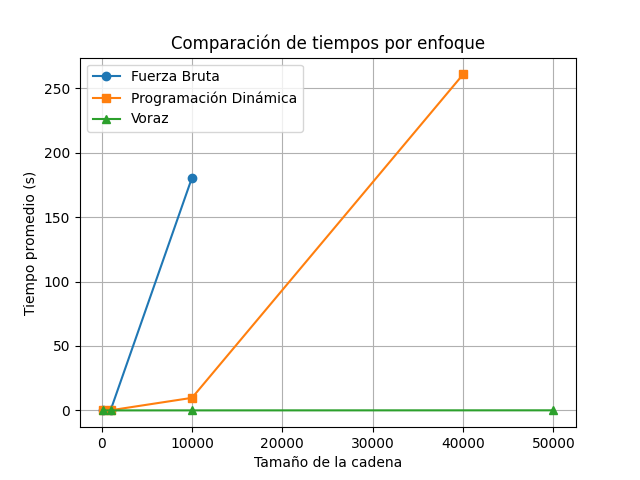

# Informe - Problema 1: Subsecuencias más largas de un palíndromo

## 1. Introducción

Este proyecto aborda el problema de encontrar la subsecuencia palindrómica más larga dentro de una cadena de caracteres. Para resolverlo, se desarrollaron tres enfoques distintos:

- Fuerza bruta
- Programación dinámica
- Algoritmo voraz

Además de la implementación de estos algoritmos, se realizaron pruebas de rendimiento con diferentes tamaños de entrada, y se compararon las complejidades teóricas y experimentales.

## 2. Formalización matemática

Dada una cadena `S = s₁s₂...sₙ`, se define una función de normalización `ϕ` tal que:

- `ϕ(c) = minúscula(c)` si `c` es alfanumérico.
- `ϕ(c) = ε` (cadena vacía) en otro caso.

Entonces, la cadena normalizada es:

`S′ = ϕ(s₁)ϕ(s₂)...ϕ(sₙ)`

Una subsecuencia palindrómica `P = p₁p₂...pₖ` de `S′` cumple:

- `P = reverse(P)`
- Existe una secuencia de índices `1 ≤ i₁ < i₂ < ... < iₖ ≤ n` tal que `pⱼ = s′ᵢⱼ` para `j = 1...k`

El objetivo es encontrar la subsecuencia palindrómica más larga, es decir:

`arg max_{P ∈ 𝒫} |P|`

donde `𝒫` es el conjunto de todas las subsecuencias palindrómicas de `S′`.

## 3. Algoritmos implementados

### 3.1 Fuerza bruta

Explora todas las subcadenas posibles y verifica si son palíndromos.

- **Código base:** `brute_force.py`
- **Complejidad temporal:** \( O(n^3) \)
- **Complejidad espacial:** \( O(1) \)

### 3.2 Programación dinámica

Construye una matriz booleana para registrar si la subcadena \( s[i:j] \) es palíndroma.

- **Código base:** `dynamic.py`
- **Complejidad temporal:** \( O(n^2) \)
- **Complejidad espacial:** \( O(n^2) \)

### 3.3 Algoritmo voraz (expansión desde el centro)

Expande desde cada posición del string para detectar palíndromos.

- **Código base:** `greedy.py`
- **Complejidad temporal:** \( O(n^2) \)
- **Complejidad espacial:** \( O(1) \)

### 3.4 Normalización

Todos los algoritmos utilizan la función `normalizar_cadena` definida en `utils.py`, la cual:

- Convierte la cadena a minúsculas
- Elimina caracteres no alfanuméricos usando expresiones regulares importando la libreria `unidecode`

## 4. Resultados experimentales

### Metodología

Se realizaron pruebas con cadenas de tamaños 100, 1000, 10000, 40000 y 50000 caracteres (según el algoritmo), repitiendo cada test 5 veces. Se utilizó `unittest` y la función `time()` para medir duración.

---

### 4.1 Fuerza bruta

Tiempos promedio para tres tamaños de prueba:

| Tamaño      | Tiempo promedio (s) |
|-------------|---------------------|
| 100         | 0.0015              |
| 1000        | 0.2928              |
| 10000       | 180.5581            |

**Ejecucion test fuerza bruta**

### 4.2 Programación dinámica

| Tamaño      | Tiempo promedio (s) |
|-------------|---------------------|
| 100         | 0.0008              |
| 1000        | 0.1017              |
| 10000       | 9.7424              |
| 40000       | 260.6721            |
| 50000       | Mi pc no lo soporta |

**Ejecucion test dinamica**

### 4.3 Algoritmo voraz

| Tamaño      | Tiempo promedio (s) |
|-------------|---------------------|
| 100         | 0.0000              |
| 1000        | 0.0000              |
| 10000       | 0.0135              |
| 50000       | 0.0601              |

**Ejecucion test voraz**

## 5. Análisis de complejidad computacional

### 5.1 Fuerza bruta

**Descripción:** Se evalúan todas las posibles subcadenas del string normalizado y se verifica si cada una es palíndroma.

- El número total de subcadenas posibles de una cadena de longitud \( n \) es \( \frac{n(n+1)}{2} \).
- Para cada subcadena se realiza una verificación de palíndromo, que toma \( O(k) \) tiempo, donde \( k \) es la longitud de la subcadena.
- En el peor caso, la longitud media de las subcadenas es \( O(n) \), por lo tanto la verificación puede costar hasta \( O(n) \).

\[
T(n) = O(n^2) \cdot O(n) = O(n^3)
\]

**Espacio adicional:** \( O(1) \) fuera de las variables locales.

---

### 5.2 Programación dinámica

**Descripción:** Se usa una matriz \( dp[i][j] \) de tamaño \( n \times n \), donde \( dp[i][j] \) es verdadero si la subcadena \( s[i:j+1] \) es un palíndromo.

- Inicialización de la diagonal (\( i = j \)) → \( O(n) \)
- Evaluación de pares adyacentes → \( O(n) \)
- Iteración para subcadenas de longitud \( \geq 3 \): doble bucle anidado con longitud y posición inicial → \( O(n^2) \)

\[
T(n) = O(n^2)
\]

**Espacio adicional:** \( O(n^2) \) por la matriz `dp`.

---

### 5.3 Algoritmo voraz (expansión desde el centro)

**Descripción:** Para cada índice de la cadena, se expande hacia ambos lados mientras los caracteres coincidan.

- Se consideran \( 2n - 1 \) centros posibles: \( n \) para palíndromos impares y \( n-1 \) para pares.
- Para cada centro, la expansión tiene un coste proporcional al máximo radio posible → \( O(n) \)

\[
T(n) = O(n) \cdot O(n) = O(n^2)
\]

**Espacio adicional:** \( O(1) \), ya que no se usa memoria adicional relevante.

---

### 5.4 Comparación teórica de algoritmos

| Algoritmo            | Tiempo      | Espacio     | Observaciones                                    |
|----------------------|-------------|-------------|--------------------------------------------------|
| Fuerza bruta         | \( O(n^3) \) | \( O(1) \)   | No escalable. Solo útil para cadenas pequeñas.   |
| Programación dinámica| \( O(n^2) \) | \( O(n^2) \) | Buen compromiso entre rendimiento y exactitud.   |
| Voraz (greedy)       | \( O(n^2) \) | \( O(1) \)   | Muy rápido. No da siempre la mejor solucion.     |

---

### 5.5 Relación con resultados empíricos

Los resultados experimentales coinciden con el análisis teórico:

- El enfoque de **fuerza bruta** muestra una explosión exponencial a medida que el tamaño de entrada crece. Tiempo inaceptable para 10,000 caracteres (180 s).
- La **programación dinámica** escala mejor, aunque para 40,000 caracteres toma más de 4 minutos.
- El algoritmo **voraz** es extremadamente eficiente incluso con 50,000 caracteres (menos de 0.1 s), confirmando que su bajo uso de recursos lo hace muy atractivo en la práctica, aunque puede no encontrar el óptimo si se esperaran múltiples palíndromos de igual longitud.

**Comparacion grafica tiempos de ejecucion**

## 6. Conclusiones

- **Correctitud:** Todos los métodos encuentran palíndromos válidos gracias a la normalización inicial.
- **Rendimiento:** El algoritmo voraz es el más rápido con diferencia, mientras que la programación dinámica ofrece un buen balance.

